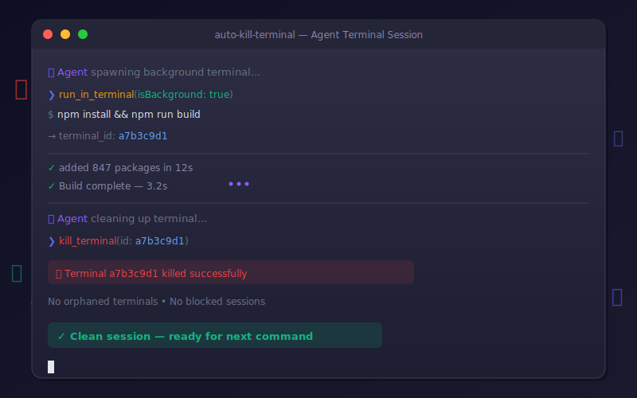

<div align="center">

```
   █████╗ ██╗   ██╗████████╗ ██████╗       ██╗  ██╗██╗██╗     ██╗     
  ██╔══██╗██║   ██║╚══██╔══╝██╔═══██╗      ██║ ██╔╝██║██║     ██║     
  ███████║██║   ██║   ██║   ██║   ██║█████╗█████╔╝ ██║██║     ██║     
  ██╔══██║██║   ██║   ██║   ██║   ██║╚════╝██╔═██╗ ██║██║     ██║     
  ██║  ██║╚██████╔╝   ██║   ╚██████╔╝      ██║  ██╗██║███████╗███████╗
  ╚═╝  ╚═╝ ╚═════╝    ╚═╝    ╚═════╝       ╚═╝  ╚═╝╚═╝╚══════╝╚══════╝
                    ████████╗███████╗██████╗ ███╗   ███╗██╗███╗   ██╗ █████╗ ██╗     
                    ╚══██╔══╝██╔════╝██╔══██╗████╗ ████║██║████╗  ██║██╔══██╗██║     
                       ██║   █████╗  ██████╔╝██╔████╔██║██║██╔██╗ ██║███████║██║     
                       ██║   ██╔══╝  ██╔══██╗██║╚██╔╝██║██║██║╚██╗██║██╔══██║██║     
                       ██║   ███████╗██║  ██║██║ ╚═╝ ██║██║██║ ╚████║██║  ██║███████╗
                       ╚═╝   ╚══════╝╚═╝  ╚═╝╚═╝     ╚═╝╚═╝╚═╝  ╚═══╝╚═╝  ╚═╝╚══════╝
```

<h3>💀 Stop AI agents from leaving zombie terminals in your Codespace</h3>

<br>

<a href="https://github.com/nirholas/auto-kill-terminal/blob/main/LICENSE"></a>
<a href="https://github.com/nirholas/auto-kill-terminal/stargazers"></a>
<a href="https://github.com/nirholas/auto-kill-terminal/network/members"></a>
<a href="#supported-agents"></a>
<a href="https://github.com/nirholas/auto-kill-terminal/issues"></a>
<a href="https://github.com/nirholas/auto-kill-terminal"></a>

<br><br>

<a href="#the-problem">Problem</a> · 
<a href="#the-fix">Fix</a> · 
<a href="#quick-start">Quick Start</a> · 
<a href="#setup-by-agent">Setup</a> · 
<a href="#why-background-terminals">How it Works</a> · 
<a href="#faq">FAQ</a>

<br>



</div>

---

## The Problem

AI coding agents (GitHub Copilot, Claude Code, Gemini, Cursor, etc.) spawn terminal sessions every time they run a command. **They almost never clean up after themselves.**

In GitHub Codespaces, this is catastrophic:

| Symptom | Cause |
|---|---|
| 🧟 **Ghost terminals** | Foreground terminals get reused — stale sessions persist and silently block new ones |
| 👻 **Invisible accumulation** | Background terminals in Codespaces aren't shown in the UI panel |
| 🔄 **Infinite retries** | Agents hammer the same dead session instead of killing it and starting fresh |
| 🆔 **Lost terminal IDs** | Without `isBackground: true`, no terminal ID is returned — cleanup is impossible |

**The result:** your Codespace fills with orphaned terminals → commands timeout → the agent gets confused → you waste tokens on retries.

## The Fix

Add terminal management rules to your agent instruction files. These **five bullet points** are all you need:

```markdown
## Terminal Management

- **Always use background terminals** (`isBackground: true`) for every command so a terminal ID is returned
- **Always kill the terminal** after the command completes, whether it succeeds or fails — never leave terminals open
- Do not reuse foreground shell sessions — stale sessions block future terminal operations in Codespaces
- In GitHub Codespaces, agent-spawned terminals may be hidden — they still work. Do not assume a terminal is broken if you cannot see it
- If a terminal appears unresponsive, kill it and create a new one rather than retrying in the same terminal
```

> **That's it.** Copy those 5 lines into whatever agent instruction file you use.

## Quick Start

```bash
# Option 1: Clone and copy what you need
git clone https://github.com/nirholas/auto-kill-terminal.git
cp auto-kill-terminal/.github/copilot-instructions.md your-project/.github/

# Option 2: Just copy the 5 bullet points from "The Fix" into your existing instruction file
```

## Setup by Agent

<details>
<summary><b>🤖 GitHub Copilot</b> — <code>copilot-instructions.md</code></summary>

```markdown
## Terminal Management
- **Always use background terminals** (`isBackground: true`) for every command so a terminal ID is returned
- **Always kill the terminal** after the command completes, whether it succeeds or fails — never leave terminals open
- Do not reuse foreground shell sessions — stale sessions block future terminal operations in Codespaces
- In GitHub Codespaces, agent-spawned terminals may be hidden — they still work. Do not assume a terminal is broken if you cannot see it
- If a terminal appears unresponsive, kill it and create a new one rather than retrying in the same terminal
```

</details>

<details>
<summary><b>🧠 Claude Code</b> — <code>CLAUDE.md</code></summary>

```markdown
### Terminal Management
- **Always use background terminals** (`isBackground: true`) for every command so a terminal ID is returned
- **Always kill the terminal** after the command completes, whether it succeeds or fails — never leave terminals open
- Do not reuse foreground shell sessions — stale sessions block future terminal operations in Codespaces
- In GitHub Codespaces, agent-spawned terminals may be hidden — they still work. Do not assume a terminal is broken if you cannot see it
- If a terminal appears unresponsive, kill it and create a new one rather than retrying in the same terminal
```

</details>

<details>
<summary><b>💎 Gemini</b> — <code>GEMINI.md</code></summary>

```markdown
### Terminal Management
- **Always use background terminals** (`isBackground: true`) for every command so a terminal ID is returned
- **Always kill the terminal** after the command completes, whether it succeeds or fails — never leave terminals open
- Do not reuse foreground shell sessions — stale sessions block future terminal operations in Codespaces
- In GitHub Codespaces, agent-spawned terminals may be hidden — they still work. Do not assume a terminal is broken if you cannot see it
- If a terminal appears unresponsive, kill it and create a new one rather than retrying in the same terminal
```

</details>

<details>
<summary><b>🔮 Cursor / AGENTS.md</b> — Multi-agent projects</summary>

```markdown
### Terminal Management
- **Always use background terminals** (`isBackground: true`) for every command so a terminal ID is returned
- **Always kill the terminal** after the command completes, whether it succeeds or fails — never leave terminals open
- Do not reuse foreground shell sessions — stale sessions block future terminal operations in Codespaces
- In GitHub Codespaces, agent-spawned terminals may be hidden — they still work. Do not assume a terminal is broken if you cannot see it
- If a terminal appears unresponsive, kill it and create a new one rather than retrying in the same terminal
```

</details>

<details>
<summary><b>⚡ One-liners</b> — For inline prompt space</summary>

Short:
```markdown
**Terminal rules:** Always use `isBackground: true` for every terminal command, then kill the terminal after.
```

Two-line:
```markdown
**Terminal management**: Always use background terminals (`isBackground: true`). Always kill terminals after use.
```

</details>

## Why Background Terminals?

| Approach | Terminal ID returned? | Can be killed? | Blocks shell? |
|---|:---:|:---:|:---:|
| `isBackground: false` | ❌ | ❌ | ✅ |
| `isBackground: true` | ✅ | ✅ (`kill_terminal`) | ❌ |

Background terminals return an ID that the agent can pass to `kill_terminal` (or `await_terminal` → `kill_terminal`). Without that ID, there's no way to clean up.

```
  Agent                                Terminal
    |                                      |
    |-- run_in_terminal -----------------> | (isBackground: true)
    |   <-- terminal_id: a7b3c9d1         |
    |                                      |
    |-- await_terminal ------------------> | (wait for completion)
    |   <-- output + exit code            |
    |                                      |
    |-- kill_terminal -------------------> | x_x
    |                                      X
    |
    |-- (clean slate for next command)
```

## Supported Environments

| Environment | Status |
|---|:---:|
| GitHub Codespaces | ✅ |
| VS Code (local) | ✅ |
| VS Code (remote SSH) | ✅ |
| VS Code (WSL) | ✅ |
| Any VS Code terminal API consumer | ✅ |

<h2 id="supported-agents">Supported Agents</h2>

| Agent | Instruction File | Status |
|---|---|:---:|
| GitHub Copilot | `copilot-instructions.md` | ✅ |
| Claude Code | `CLAUDE.md` | ✅ |
| Gemini | `GEMINI.md` | ✅ |
| Cursor | `AGENTS.md` / `.cursorrules` | ✅ |
| Windsurf | `AGENTS.md` | ✅ |
| Aider | `.aider.conf.yml` | ✅ |
| Any agent using VS Code terminals | Any instruction file | ✅ |

## FAQ

<details>
<summary><b>Do I need to install anything?</b></summary>

No. This is just copy-paste text that goes into your agent instruction files. No packages, no extensions, no config.

</details>

<details>
<summary><b>Does this work outside Codespaces?</b></summary>

Yes. The terminal management rules work anywhere VS Code's terminal API is used. They're most critical in Codespaces because ghost terminals are invisible there, but they help everywhere.

</details>

<details>
<summary><b>What if my agent doesn't support instruction files?</b></summary>

You can include the rules in your prompt directly. Use the one-liner from the "One-liners" section above.

</details>

<details>
<summary><b>Will this break my agent's workflow?</b></summary>

No. Background terminals with `isBackground: true` behave the same as foreground terminals, except they don't block the shell and they return an ID for cleanup. The agent's commands still execute normally.

</details>

## Contributing

Contributions are welcome! If you've found terminal management tricks for other agents or environments, please open a PR.

1. Fork the repo
2. Create your branch: `git checkout -b feat/my-improvement`
3. Commit: `git commit -m "✨ feat: add support for X agent"`
4. Push: `git push origin feat/my-improvement`
5. Open a Pull Request

## License

MIT © [nirholas](https://github.com/nirholas)

---

<p align="center">
  <b>Stop wasting tokens on zombie terminals.</b><br>
  <sub>Made with 💀 for the AI agent community</sub>
</p>

<p align="center">
  <br>
  ⭐ <b>Found this useful? Star the repo!</b> ⭐<br>
  <sub>It helps others discover this project and keeps development active</sub><br><br>
  <a href="https://github.com/nirholas/auto-kill-terminal/stargazers">
    
  </a>
</p>

<p align="center">
  <a href="https://star-history.com/#nirholas/auto-kill-terminal&Date">
    <picture>
      <source media="(prefers-color-scheme: dark)" srcset="https://api.star-history.com/svg?repos=nirholas/auto-kill-terminal&type=Date&theme=dark" />
      <source media="(prefers-color-scheme: light)" srcset="https://api.star-history.com/svg?repos=nirholas/auto-kill-terminal&type=Date" />
      
    </picture>
  </a>
</p>

